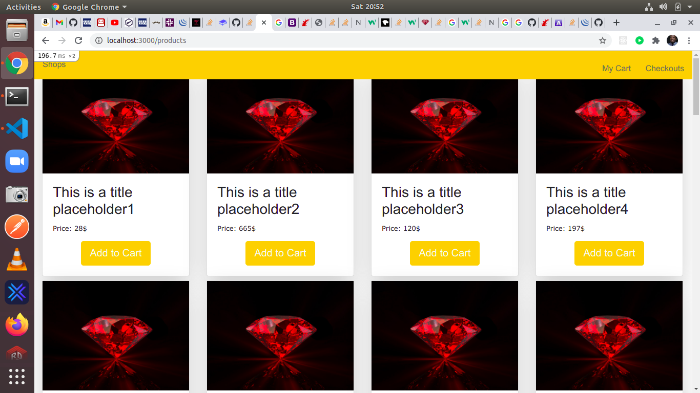

# lernen
This is an assignment given by create21 


## Descritpion
Task is to &quot;prototype&quot; a very small online shop using Ruby on Rails. Try to come
up with a small concept in advance (based on the information provided below) and
then in as little time as possible to implement this shop.

## Technologies

- HTML
- ERB
- Ruby
- Ruby on Rails 
- SASS
- JQUERY

## Features
- Create Product
- Read Product
- Delete Product
- Add to cart 
- View Cart 
- Checkout

## Potential feature

- Add roles
- Code optimization

## Live demo
- [Link of dem]

## video presenation demo

- [Link of video]

## Usage

> Clone the repository to your local machine

```sh
$ git clone https://github.com/forison/lernen.git
```
> cd into the directory

```sh
$ cd lernen
```

> open by issuing the command ```rails s```

## Testing

> Clone the repository to your local machine

```sh
$ git clone https://github.com/forison/lernen.git
```
> cd into the directory

```sh
$ cd social-network
```

> run ```bundle exec rspec```

## Deployment

The demo page can be found [HERE](https://nosebook.herokuapp.com)

## Designed and developed by

[Boakye Addo Forison](https://github.com/Forison)

## Contact

[LinkedIn](https://www.linkedin.com/in/forison/) | [Twitter](https://twitter.com/addo_forison)

## Appreciation

[Microverse](https://www.microverse.org/ "The Global School for Remote Software Developers!")

## Contributing

1. Fork it (https://github.com/Forison/lernen/)
2. Create your feature branch (git checkout -b feature/[choose-a-name])
3. Commit your changes (git commit -am 'What this commit will fix/add')
4. Push to the branch (git push origin feature/[chosen name])
5. Create a new Pull Request

## License

This project is licensed under the MIT License - see the [LICENSE](./LICENSE.md) file for details
